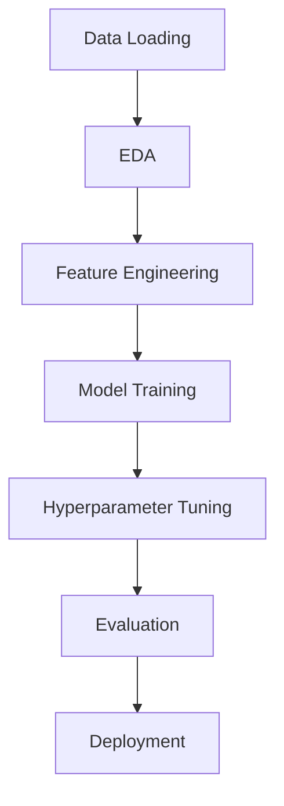

# 🚗 Used Car Price Prediction - Machine Learning Project

🔹 **Author**: Mohammad Umar  
🔹 **Contact**: [umar.test.49@gmail.com](mailto:umar.test.49@gmail.com)  

---

## 📌 Section 1: Introduction and Objective

In the rapidly growing automobile industry, accurately pricing used vehicles is complex due to numerous influencing factors. This project leverages Machine Learning to predict car prices based on structured data features.

### Client (Assumed):
Startup platform for second-hand car sales needing instant price estimations.

### Problem Statement:
Predict car listing prices using vehicle features to enable better pricing strategies.

### Importance:
- Provides pricing transparency
- Reduces reliance on human estimators
- Improves market competitiveness
- Scalable for e-commerce integration

### Objective:
Build an end-to-end ML system with:
- Accurate price prediction model
- User-friendly Streamlit web interface
- Interpretable feature importance

---

## 📊 Section 2: Dataset

### Dataset Overview:
- **Source**: Internal `dataset.csv`
- **Size**: ~950 rows × 60+ features (post-processing)
- **Target**: `price` (log-transformed for stability)

### Key Features:
| Category        | Features                          |
|-----------------|-----------------------------------|
| **Numerical**   | year, mileage, cylinders, doors   |
| **Categorical** | model, fuel, transmission, color  |
| **Text**        | vehicle description (TF-IDF)      |

### Preprocessing:
1. Handled missing values (median/"Unknown")
2. TF-IDF on descriptions (top 100 keywords)
3. One-hot encoding for categoricals
4. MinMax scaling for numericals

### Key Observations:
- Price distribution required log transformation
- Text descriptions added marginal predictive value
- Simplified rare categories in fuel/transmission

---

## ⚙️ Section 3: Design / Workflow

## ⚙️ Implementation Details

### Data Preparation
- **Data Cleaning**:
  - Null value imputation (median for numerical, "Unknown" for categorical)
  - Duplicate removal
  - Category standardization (consistent casing/labels)

### Feature Engineering
- **Text Features**:
  - TF-IDF vectorization of descriptions (top 100 keywords)
- **Structured Features**:
  - One-hot encoding for fuel/transmission
  - Label encoding for model/color
  - MinMax scaling for numerical features
- **Final Feature Set**: 113 dimensions (100 text + 13 structured)

### Model Development
- **Algorithms Evaluated**:
  1. Linear Regression (baseline)
  2. Decision Tree
  3. Random Forest
  4. XGBoost
  5. **LightGBM** (selected as best performer)
- **Hyperparameter Tuning**:
  - Used Optuna + GridSearchCV
  - Tuned: `num_leaves`, `max_depth`, `learning_rate`

### Deployment
- **Streamlit App**:
  - Dropdown selectors for categorical features
  - Sliders for numerical inputs
  - Real-time price prediction display
- **Pipeline**:
  - Saved model + encoders for consistent inference

---

## 📈 Section 4: Results

### ✅ Final Model Performance
| Metric    | LightGBM (Tuned) |
|-----------|------------------|
| RMSE      | 12,198.57        |
| MAE       | 6,811.57         |
| R² Score  | 0.69             |

### Model Comparison
| Model            | R² Score | RMSE      |
|------------------|----------|-----------|
| Linear Regression| 0.42     | 18,100+   |
| LightGBM         | 0.69     | 12,198    |

### 🔍 Key Insights
- **Top Predictive Features**:
  1. Vehicle year
  2. Mileage
  3. Fuel type
- **Text Impact**: Descriptions contributed ~5% to R²
- **Error Analysis**:
  - Residuals normally distributed
  - Best performance on mid-range vehicles ($15k-$30k)

---

## ✅ Section 5: Conclusion

### 🏆 Achievements
- Built production-ready predictor with **0.69 R²**
- Created intuitive **Streamlit interface**
- Implemented **SHAP explanations** for transparency

### 🧩 Challenges
- **Data Sparsity**:
  - Limited text descriptions
  - Rare categories in features
- **Technical Hurdles**:
  - Feature/model version mismatch
  - Log-transform required for price stability

### 🚀 Future Roadmap
1. **Enhanced Deployment**:
   - Dockerized FastAPI microservice
   - AWS/GCP cloud integration
2. **Advanced Features**:
   - VIN decoder integration
   - CNN-based image assessment
3. **MLOps**:
   - Continuous retraining pipeline
   - Prediction monitoring

### 📚 Key Learnings
- Importance of **log transformations** for skewed targets
- **Tradeoffs** in feature engineering complexity
- End-to-end **ML system design** considerations

---

📌 **Tags**: `#MachineLearning` `#PricePrediction` `#Automotive` `#DataScience`
